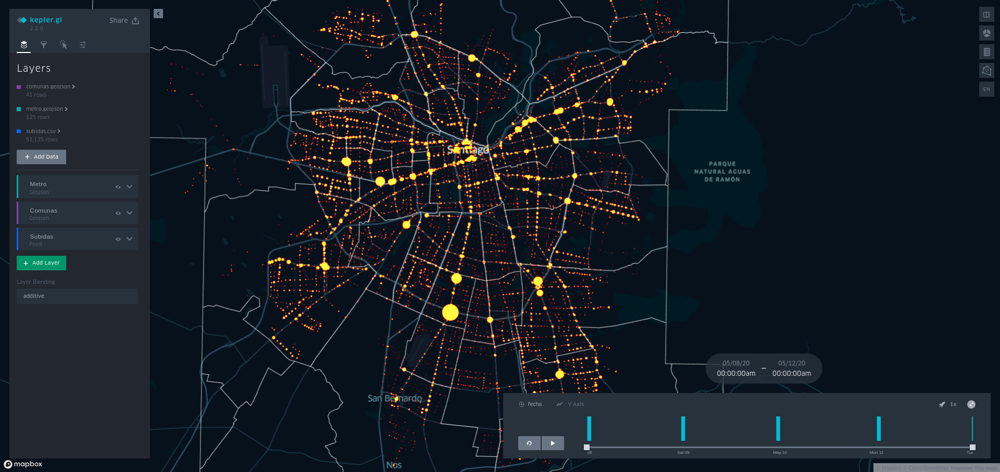

[](https://travis-ci.com/SmartcitySantiagoChile/TransactionByStopVis)
[](https://coveralls.io/github/SmartcitySantiagoChile/TransactionByStopVis?branch=master)

# TransactionByStopVis

To create a visualization with bip! transactions for each stop (bus or metro) per day

## Requirements

- Python 3
- Dependencies: requirements.txt
- stops.csv 

## Installation

It's recommended to use a virtual enviroment:

```
virtualenv venv
```
If you are using Python 2.7 by default is needed to define a Python3 flag:

```
virtualenv -p python3 venv
```

Activate virtual env and install dependencies:
```
source venv/bin/activate
 
pip install -r requirements.txt
```


### .env file
You need to define the environment keys in a .env file:
```
AWS_ACCESS_KEY_ID='PUT_HERE_YOUR_ACCESS_KEY'
AWS_SECRET_ACCESS_KEY='PUT_HERE_YOUR_SECRET_ACCESS_KEY'
EARLY_TRANSACTION_BUCKET_NAME='PUT_HERE_YOUR_TRANSACTION_BUCKET_NAME'
MAPBOX_KEY='PUT_HERE_YOUR_MAPBOX_KEY'
```

PUT_HERE_YOUR_ACCESS_KEY y PUT_HERE_YOUR_SECRET_ACCESS_KEY can be obtained by an AWS user credentials (https://console.aws.amazon.com/iam/home?#/users).

EARLY_TRANSACTION_BUCKET_NAME ...

MAPBOX_KEY can be obtained can be obtained by a Mapbox Account (https://docs.mapbox.com/help/how-mapbox-works/access-tokens/)

## Run tests

You can run the tests using:

```
python -m unittest
```

## Usage    

To run TransactionByStopVis you need to execute:

```
python process_data.py [start_date] [end_date] [output_name]

```
- [OUTPUT_NAME] html file name
- [start_date] start date in YY-MM-DD format.
- [end_date]  end date in YY-MM-DD format.


The output file will be a html file saved at outputs path. 
## Help

TODO

## Tutorial

#### Executing the command

First we're going go to execute process_data.py between 2020-05-08 and 2020-05-12


```
python process_data.py 2020-05-08  2020-05-12 tutorial
```
If all runs successfully we get the output:
```
> tutorial successfully created!
```

The output can be opened with a web navigator and looks like:




## FAQ

### Where do we get stop file?

It is one of inputs for adatrap vis, it represents a set of valid stops for period of time (operational program duration)
