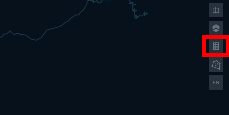

[](https://travis-ci.com/SmartcitySantiagoChile/TransactionByStopVis)
[](https://coveralls.io/github/SmartcitySantiagoChile/TransactionByStopVis?branch=master)

# TransactionByStopVis

To create a visualization with bip! transactions for each stop (bus or metro) per day.

## Requirements

- Python 3
- Dependencies: requirements.txt
- stops.csv 
### Install Python 3
#### Windows users

You need to download  Python 3 from the official web site:
 
 https://www.python.org/downloads/windows/

Select the version and download either the <strong> Windows x86-64 executable installer </strong> or <strong> Windows x86 executable installer</strong>.

Run the Python Installer once downloaded. (In this example, we have downloaded Python 3.8.3). 


Make sure you select the <strong>Install launcher for all users </strong> and <strong> Add Python 3.8 </strong> to PATH checkboxes. The latter places the interpreter in the execution path.


After setup was succesfull check the <strong>Disable path length limit </strong> option. Choosing this option
 will allow Python to bypass the 260-character MAX_PATH limit. It is recommended to resolve potential lenght
  issues that may arise with Python projects developed in Linux (Like this project.) 


### Install the project

First clone the repository:

```
git clone https://github.com/SmartcitySantiagoChile/TransactionByStopVis
```


It's recommended to use a virtual enviroment to keep dependencies required by different projects separate by creating isolated python virtual environments for them.

To create a virtual enviroment:

```
virtualenv venv
```
If you are using Python 2.7 by default is needed to define a Python3 flag:

```
virtualenv -p python3 venv
```

Activate virtual env and install dependencies:
```
source venv/bin/activate
 
pip install -r requirements.txt
```


### .env file
The env files allow you to put your environment variables inside a file,
 it is recommended to only have to worry once about the setup and configuration of the application
 and to not store passwords and sensitive information in the online repository.
 
You need to define the environment keys creating an .env file at root path:
```
AWS_ACCESS_KEY_ID='PUT_HERE_YOUR_ACCESS_KEY'
AWS_SECRET_ACCESS_KEY='PUT_HERE_YOUR_SECRET_ACCESS_KEY'
EARLY_TRANSACTION_BUCKET_NAME='PUT_HERE_YOUR_TRANSACTION_BUCKET_NAME'
MAPBOX_KEY='PUT_HERE_YOUR_MAPBOX_KEY'
```

PUT_HERE_YOUR_ACCESS_KEY y PUT_HERE_YOUR_SECRET_ACCESS_KEY can be obtained by an AWS user credentials (https://console.aws.amazon.com/iam/home?#/users).

EARLY_TRANSACTION_BUCKET_NAME is the name for aws bucket.

MAPBOX_KEY can be obtained by a Mapbox Account (https://docs.mapbox.com/help/how-mapbox-works/access-tokens/)

## Run tests
To verify that everything works well on your computer you can run these automatic tests that will tell you if there is a problem:

```
python -m unittest
```

## Usage    

To run TransactionByStopVis you need to execute:


python process_data.py [start_date] [end_date] [output_name]

```
- [output_name] html file name
- [start_date] start date in YY-MM-DD format.
- [end_date]  end date in YY-MM-DD format.
```


The output file will be a html file saved at outputs path. 
## Help

To get help with the command you need to execute:

```
python process_data.py -h 
```

## Tutorial

#### Executing the command

First we're going go to execute process_data.py between 2020-05-08 and 2020-05-12


```
python process_data.py 2020-05-08  2020-05-12 tutorial
```
If all runs successfully we get the output:
```
> tutorial successfully created!
```

The output can be opened with a web navigator and looks like:


If you want to show legend info, you should click de upper right icon:




If you click the stops it will show info:


You can show Metro stops clicking on the left column (eye icon):


You can use the timeline to see the change through time:


## FAQ

### Where do we get stop file?

It is one of inputs for adatrap vis, it represents a set of valid stops for period of time (operational program duration)
